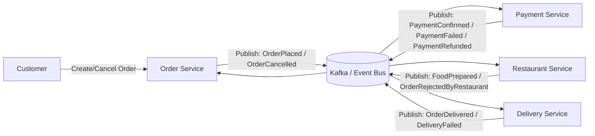
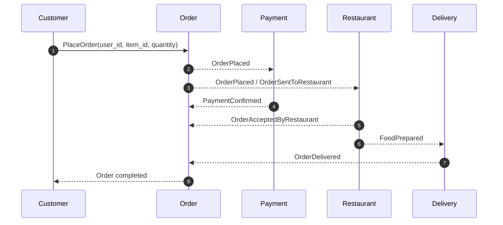
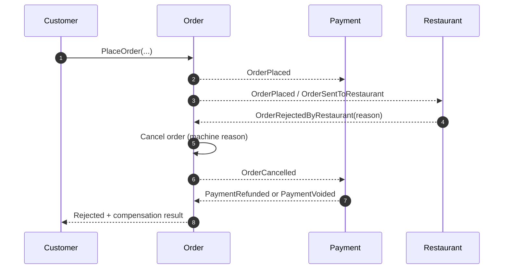
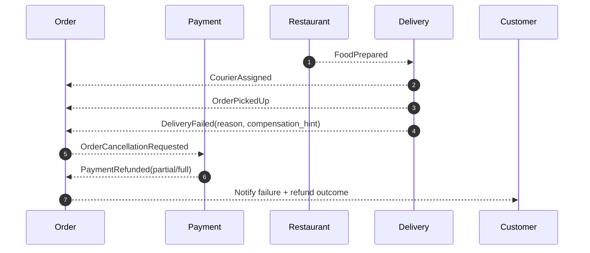

# Architecture

## Business Rules Documents

- [`order` rules](./order-business-rules.md)
- [`payment` rules](./payment-business-rules.md)
- [`restaurant` rules](./restaurant-business-rules.md)
- [`delivery` rules](./delivery-business-rules.md)

## Business Rules (Event Storming)

### Event Types

- `Domain` events: business state changes produced and consumed inside the same bounded context.
- `Integration` events: cross-context contracts published for other services.

### 1. Order Context (`order` service)

- `OrderPlaced` - `Integration`
- `OrderConfirmed` - `Domain`
- `OrderCancelled` - `Integration`

### 2. Payment Context (`payment` service)

- `PaymentInitiated` - `Domain`
- `PaymentConfirmed` - `Integration`
- `PaymentRefunded` - `Integration`

### 3. Restaurant Context (`restaurant` service)

- `OrderSentToRestaurant` - `Integration`
- `OrderAcceptedByRestaurant` - `Domain`
- `OrderRejectedByRestaurant` - `Integration`
- `FoodPrepared` - `Integration`

### 4. Delivery Context (`delivery` service)

- `CourierAssigned` - `Domain`
- `OrderPickedUp` - `Domain`
- `OrderDelivered` - `Integration`
- `DeliveryFailed` - `Integration`

## System Context Map

## Workflow: Happy Path

## Workflow: Restaurant Rejects Order

## Workflow: Delivery Fails After Pickup

